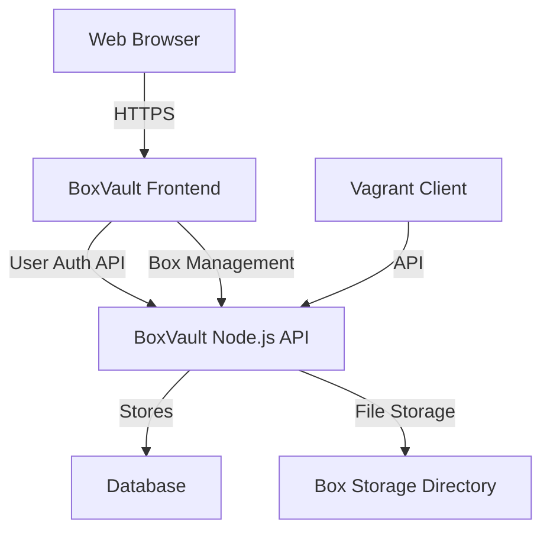

## BoxVault Documentation

{: .fs-9 }

Node.js and React-based web application for managing Vagrant box repositories. Provides user management, organization control, and comprehensive API for uploading, versioning, and distributing Vagrant boxes.
{: .fs-6 .fw-300 }

[Get started now](#getting-started){: .btn .btn-primary .fs-5 .mb-4 .mb-md-0 .mr-2 }
[View API Reference](docs/api/){: .btn .fs-5 .mb-4 .mb-md-0 }
[View on GitHub](https://github.com/Makr91/BoxVault){: .btn .fs-5 .mb-4 .mb-md-0 }

---

## Getting started

BoxVault is a comprehensive Vagrant box repository management system that provides both a web interface and RESTful API for managing Vagrant boxes, versions, providers, and architectures within organizations.

### Key Features

- **User Management**: Complete user authentication and authorization system with JWT tokens
- **Multi-Organization Support**: Organization-based access control and box management
- **Box Management**: Upload, version, and distribute Vagrant boxes with metadata
- **Provider Support**: Support for multiple providers (VirtualBox, VMware, etc.)
- **Architecture Support**: Multi-architecture box support (x86_64, arm64, etc.)
- **File Management**: Secure file upload/download with range request support
- **API Integration**: Comprehensive RESTful API with Swagger documentation
- **Responsive Design**: Modern React-based interface for box management

### Architecture

### Quick start

1. **Installation**: Install BoxVault via package or build from source
2. **Configuration**: Configure database and storage settings
3. **Setup**: Create initial organization and admin user
4. **Upload**: Start uploading and managing Vagrant boxes
5. **Access**: Use web interface or API to manage your box repository

### Documentation

BoxVault provides comprehensive documentation:

- **[API Reference](docs/api/)** - Complete API documentation with Swagger
- **[Getting Started Guide](docs/guides/getting-started/)** - Step-by-step setup instructions
- **[Installation Guide](docs/guides/installation/)** - Installation and deployment
- **[User Guide](docs/guides/user-guide/)** - Web interface usage and features
- **[Authentication Guide](docs/guides/authentication/)** - User and API authentication

---

## About the project

BoxVault is &copy; 2025 by the BoxVault Project.

### License

BoxVault is distributed by an [GPL-3.0 license](https://github.com/Makr91/BoxVault/blob/main/LICENSE.md).

### Contributing

When contributing to this repository, please first discuss the change you wish to make via issue, email, or any other method with the owners of this repository before making a change. Read more about becoming a contributor in [our GitHub repo](https://github.com/Makr91/BoxVault#contributing).

#### Thank you to the contributors of BoxVault!

<ul class="list-style-none">

  <li class="d-inline-block mr-1">
     
  </li>

</ul>

### Code of Conduct

BoxVault is committed to fostering a welcoming community.

[View our Code of Conduct](https://github.com/Makr91/BoxVault/tree/main/CODE_OF_CONDUCT.md) on our GitHub repository.
